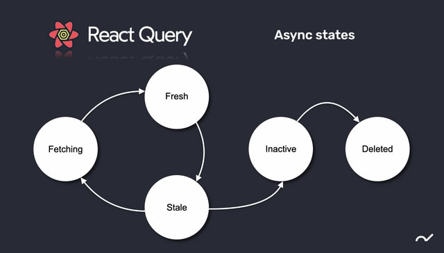

### React Query
---

---

1. Fetching: API 가 호출되고 있는 상태 
2. Fresh: Data가 도착한 상태
3. Stale: Data 가 도착해서 시간이 지난 상태 (유통기한 만료 - 상함)
> 두가지로 구분하는 이유는 fresh 한 상태일 때는 API 를
API 를 호출할 필요가 없다. 

- Data가 Stale한 상태이면 다시 Fetching을 한다. 
--- 
4. Inactive: 더 이상 이 캐시를 사용하지 않는 상태
5. Deleted: 삭제
